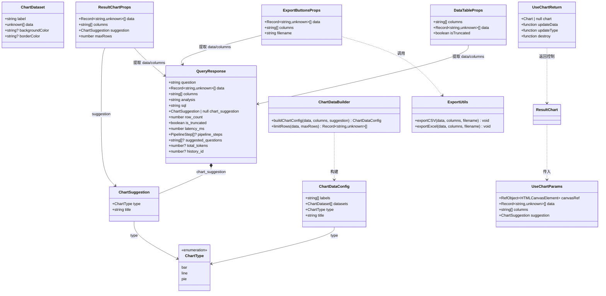
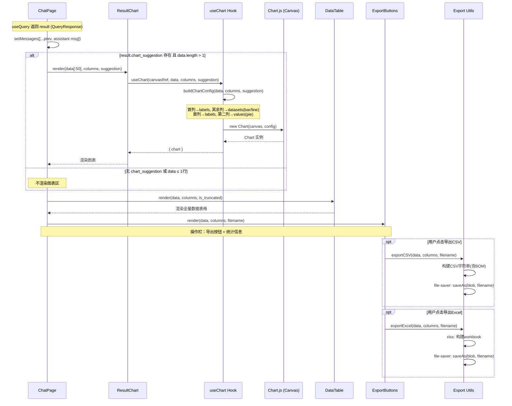
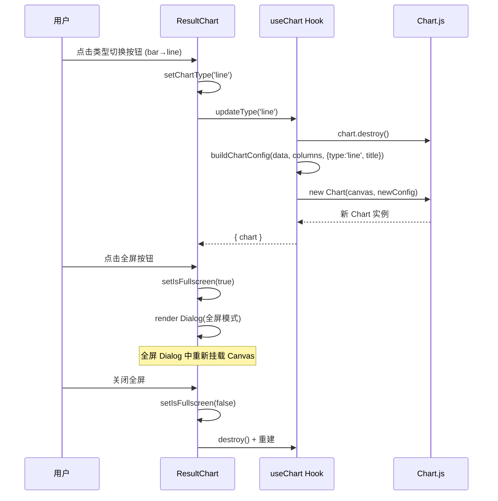
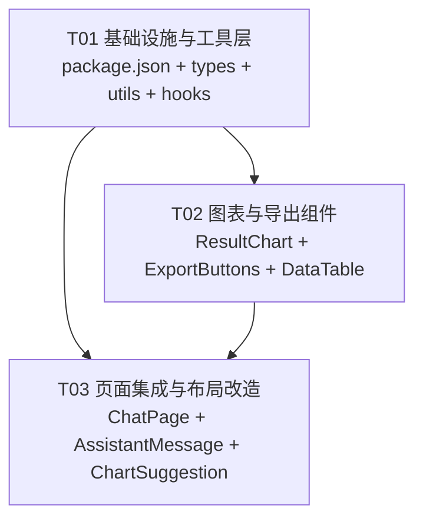

# 天府一网监 — 查询结果图表可视化 & 数据导出 系统设计

> **架构师**: Bob | **日期**: 2025-06-11 | **版本**: v1.0

---

## Part A: 系统设计

### 1. 实现方案

#### 1.1 核心技术难点

| 难点 | 描述 | 对策 |
|------|------|------|
| chart.js 原生集成 | PRD 要求不使用 react-chartjs-2 封装，需手动管理 Canvas 生命周期 | 开发 `useChart` hook，封装 chart.js 实例的创建/更新/销毁 |
| 图表自动推导 | 后端 `chart_suggestion` 仅给 type/title，不指定 x/y 轴映射 | 前端自动推导：首列作 labels，其余列作 datasets（bar/line）；首列作 labels，第二列作 values（pie） |
| Excel 导出 | 需要引入额外依赖，CSV 需处理中文 BOM | 使用 `xlsx`（SheetJS）+ `file-saver`，CSV 统一添加 UTF-8 BOM |
| 图表工具栏 | P1 需求：类型切换 + 全屏 | ResultChart 内置工具栏，类型切换即时重建 chart.js 实例 |
| 截断数据 | 后端 `is_truncated` 标记数据被截断 | 图表仅用前 50 行；表格展示全部数据；截断时在操作栏显示提醒 |

#### 1.2 框架与库选型

| 用途 | 选型 | 理由 |
|------|------|------|
| 图表渲染 | **chart.js v4.5**（原生） | 已在依赖中；原生 API 更灵活，避免 react-chartjs-2 额外抽象层 |
| CSV 导出 | **file-saver v2** | 已在依赖中；标准的浏览器端文件保存方案 |
| Excel 导出 | **xlsx (SheetJS) v0.18** | 社区标准；支持 `.xlsx` 格式；体积可控 |
| 前端框架 | React 18 + MUI 6 + Tailwind CSS 3 | 现有技术栈，保持不变 |

#### 1.3 架构模式

- **组件模式**: Presentational + Container 分离 — `ResultChart`、`ExportButtons`、`DataTable` 为纯展示组件，`ChatPage` 为容器组件负责数据分发
- **Hook 模式**: `useChart` 封装 chart.js Canvas 生命周期；`useExport` 封装导出逻辑
- **状态管理**: 无全局状态，全部通过 Props 传递（图表全屏状态为组件内部 state）

---

### 2. 文件列表

```
lingwen/frontend/
├── package.json                                          # [修改] 新增 xlsx 依赖
├── src/
│   ├── types/
│   │   └── query.ts                                      # [修改] ChartSuggestion 类型增强
│   ├── hooks/
│   │   └── useChart.ts                                   # [新建] chart.js 生命周期管理 hook
│   ├── utils/
│   │   ├── formatters.ts                                 # [修改] 新增图表数据构建函数
│   │   └── export.ts                                     # [新建] CSV/Excel 导出工具函数
│   ├── components/
│   │   └── chat/
│   │       ├── ResultChart.tsx                           # [新建] 图表可视化组件（含工具栏）
│   │       ├── ExportButtons.tsx                         # [新建] 导出按钮组（CSV + Excel）
│   │       ├── DataTable.tsx                             # [修改] 增强表格功能（截断标记传入）
│   │       ├── AssistantMessage.tsx                      # [修改] 引入 ResultChart + ExportButtons
│   │       └── ChartSuggestion.tsx                       # [标记废弃] 功能被 ResultChart 取代
│   └── pages/
│       └── ChatPage.tsx                                  # [修改] 重构结果区布局
```

**文件统计**: 新建 3 个文件，修改 5 个文件，标记废弃 1 个文件

---

### 3. 数据结构与接口



---

### 4. 程序调用流

#### 4.1 查询完成 → 渲染流程



#### 4.2 图表工具栏操作流



---

### 5. 不清楚/待确认事项

| # | 事项 | 当前假设 |
|---|------|---------|
| 1 | `chart_suggestion` 是否包含 x_axis / y_axis 字段？ | **假设不包含**，前端自动推导：首列→labels，其余列→datasets |
| 2 | Excel 导出格式要求？是否需多 Sheet？ | **假设单 Sheet**，数据平铺，带表头行 |
| 3 | 图表颜色方案 | **假设使用 chart.js 默认调色板**，后续可扩展 |
| 4 | `ChartSuggestion.tsx` 旧组件是否还有其他引用？ | 搜索确认后标记废弃，由 ResultChart 取代 |

---

## Part B: 任务分解

### 6. 依赖包清单

```
- chart.js@^4.5.1              # 已在 package.json，图表渲染引擎
- file-saver@^2.0.5             # 已在 package.json，浏览器端文件保存
- @types/file-saver@^2.0.7      # 已在 package.json，TypeScript 类型
- xlsx@^0.18.5                  # 【新增】SheetJS — Excel (.xlsx) 读写
- react@^18.3.1                 # 已有
- @mui/material@^6.1.0          # 已有
- @mui/icons-material@^6.1.0    # 已有
```

---

### 7. 任务列表

#### T01 — 基础设施与工具层

| 字段 | 值 |
|------|-----|
| **Task ID** | T01 |
| **Task Name** | 基础设施与工具层：依赖声明、类型增强、工具函数、Hook |
| **Source Files** | `package.json`, `src/types/query.ts`, `src/utils/export.ts`, `src/hooks/useChart.ts`, `src/utils/formatters.ts` |
| **Dependencies** | 无 |
| **Priority** | P0 |
| **描述** | 1. `package.json` 新增 `xlsx` 依赖并 `npm install`；2. `query.ts` 增强 `ChartSuggestion` 类型（`type` 收窄为 `'bar' | 'line' | 'pie'`）；3. `export.ts` 新建，实现 `exportCSV()`（含 UTF-8 BOM，用 file-saver）和 `exportExcel()`（用 xlsx + file-saver）；4. `useChart.ts` 新建，封装 chart.js 实例的创建/更新/销毁/类型切换；5. `formatters.ts` 新增 `buildChartConfig()` 和 `limitRows()` |

#### T02 — 图表与导出组件

| 字段 | 值 |
|------|-----|
| **Task ID** | T02 |
| **Task Name** | 图表与导出组件：ResultChart + ExportButtons + DataTable 增强 |
| **Source Files** | `src/components/chat/ResultChart.tsx`, `src/components/chat/ExportButtons.tsx`, `src/components/chat/DataTable.tsx` |
| **Dependencies** | T01 |
| **Priority** | P0 |
| **描述** | 1. `ResultChart.tsx`：独立图表组件，Props 接受 `data/columns/suggestion`，内部使用 `useChart` hook 管理 chart.js 实例；内置工具栏（类型切换 bar/line/pie + 全屏 Dialog）；数据自动限制前 50 行；无 chart_suggestion 或数据≤1行时返回 null；2. `ExportButtons.tsx`：导出按钮组件，包含"导出 CSV"和"导出 Excel"两个 MUI Button，调用 `export.ts` 工具函数；3. `DataTable.tsx`：增加 `isTruncated` prop，截断时在表格底部显示提示文字 |

#### T03 — 页面集成与布局改造

| 字段 | 值 |
|------|-----|
| **Task ID** | T03 |
| **Task Name** | 页面集成与布局改造：ChatPage 重构 + AssistantMessage 更新 + ChartSuggestion 废弃 |
| **Source Files** | `src/pages/ChatPage.tsx`, `src/components/chat/AssistantMessage.tsx`, `src/components/chat/ChartSuggestion.tsx` |
| **Dependencies** | T01, T02 |
| **Priority** | P0 |
| **描述** | 1. `ChatPage.tsx`：重构结果区布局为 **图表 → 表格 → 操作栏** 的垂直结构；引入 `ResultChart`、`DataTable`、`ExportButtons`；操作栏整合导出按钮 + 耗时/Token 统计 + 截断提醒；2. `AssistantMessage.tsx`：同步更新，也引入 `ResultChart` + `ExportButtons`，统一渲染逻辑（如 ChatPage 已内联处理则可保持现状，仅做一致性检查）；3. `ChartSuggestion.tsx`：添加 `@deprecated` JSDoc 注释，功能已被 `ResultChart` 取代，保留文件避免 Breaking Change |

---

### 8. 共享知识

```
- 所有 API 响应使用 {code, data, message} 格式
- chart.js 图表数据限制前 50 行（maxRows=50），表格展示全量
- CSV 导出必须添加 UTF-8 BOM（\uFEFF）确保中文在 Excel 中正常显示
- Excel 导出使用 xlsx 库，单 Sheet，表头加粗
- useChart hook 在组件卸载时自动 destroy() chart 实例
- 类型切换时先 destroy() 旧实例再创建新实例
- 全屏模式在 MUI Dialog 中渲染，退出时重建图表
- chart_suggestion.type 收窄为 'bar' | 'line' | 'pie'
- 图表自动推导规则：首列→labels；bar/line→其余列各为一个 dataset；pie→第二列作为 values
- 所有日期存储为 ISO 8601 UTC
```

---

### 9. 任务依赖图



---

## 附录：关键设计细节

### A. useChart Hook 设计

```typescript
// src/hooks/useChart.ts
import { useEffect, useRef, useCallback } from 'react';
import { Chart, ChartConfiguration, registerables } from 'chart.js';
import type { ChartSuggestion, ChartType } from '../types';

// 全局注册一次
Chart.register(...registerables);

interface UseChartOptions {
  canvasRef: React.RefObject<HTMLCanvasElement | null>;
  data: Record<string, unknown>[];
  columns: string[];
  suggestion: ChartSuggestion | null;
  maxRows?: number;
}

interface UseChartReturn {
  chartRef: React.MutableRefObject<Chart | null>;
  updateType: (type: ChartType) => void;
}

export function useChart(options: UseChartOptions): UseChartReturn {
  // 创建 → 更新 → 销毁 生命周期
  // updateType 切换图表类型（destroy + recreate）
}
```

### B. 导出工具函数签名

```typescript
// src/utils/export.ts
export function exportCSV(
  data: Record<string, unknown>[],
  columns: string[],
  filename?: string
): void;

export function exportExcel(
  data: Record<string, unknown>[],
  columns: string[],
  filename?: string
): void;
```

### C. ResultChart 工具栏布局

```
┌─────────────────────────────────────────────┐
│  图表标题                          [↔全屏]  │
│  ┌───────────────────────────────────────┐  │
│  │                                       │  │
│  │          Chart.js Canvas              │  │
│  │                                       │  │
│  └───────────────────────────────────────┘  │
│  [bar] [line] [pie]                         │
└─────────────────────────────────────────────┘
```
